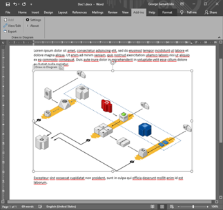

# OfficeDrawIo
**[Draw.io](https://about.draw.io/) Add-In for Microsoft Office.**

Allows embedding and editing Draw.io images in Microsoft Office documents.

Technical Description
-----------
The Add-In is implemented as an Office VSTO Add-In in mainly C# and a hint of JavaScript.

Known issues
------------
- Only Word is currently supported due to VSTO custom control restrictions.
- Copy-paste (effectively cloning) of complete Word Draw.io diagram controls does not work inbetween different Word documents, only within the same document. Workaround is to create a new diagram in the target document and then copy the diagram contents from the first document to it.

Runtime Requirements
--------------------
- Windows 10 ([.NET Framework](https://dotnet.microsoft.com/download/dotnet-framework) 4.6 or better).
- Office 2017 (may work in earlier versions but not tested).
- [Drawio Desktop](https://about.draw.io/integrations/).

Screenshots
-----------

